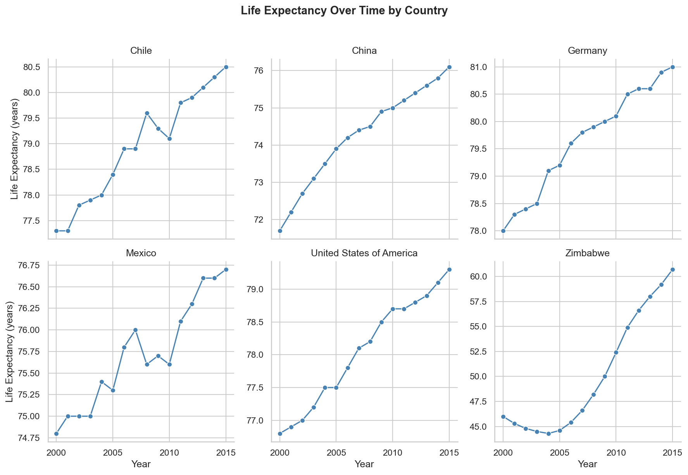
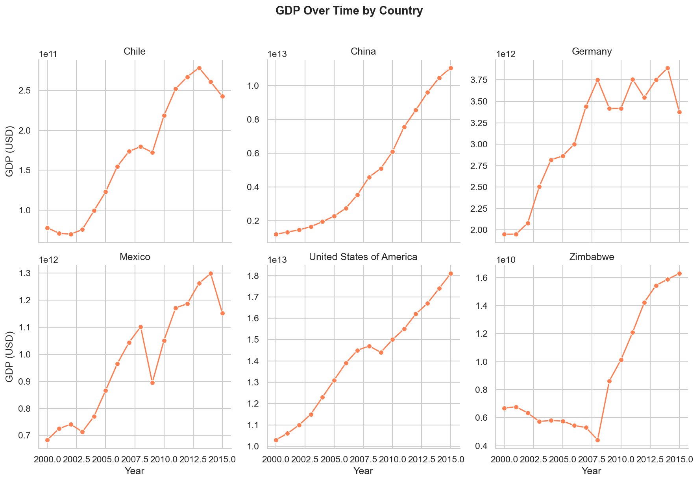
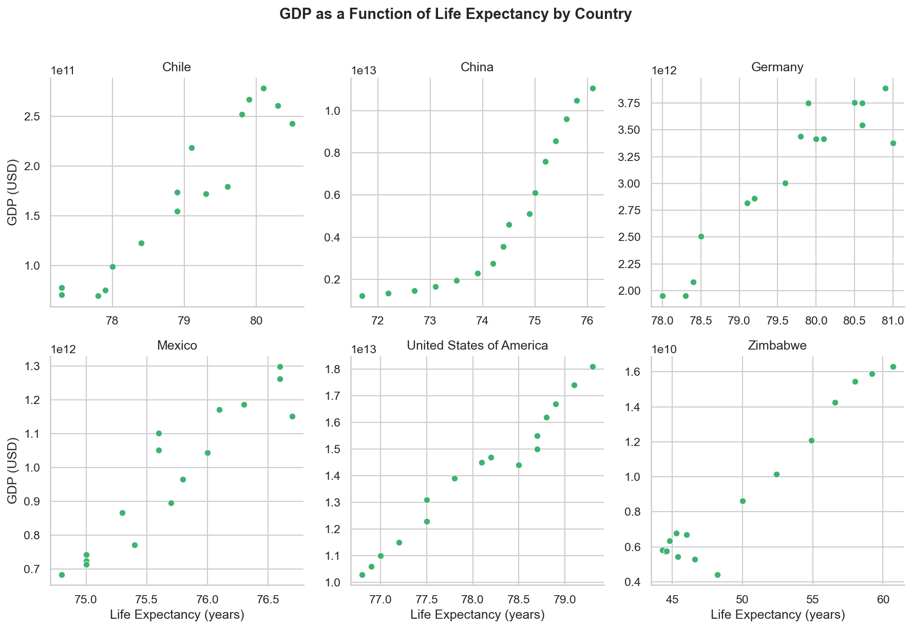
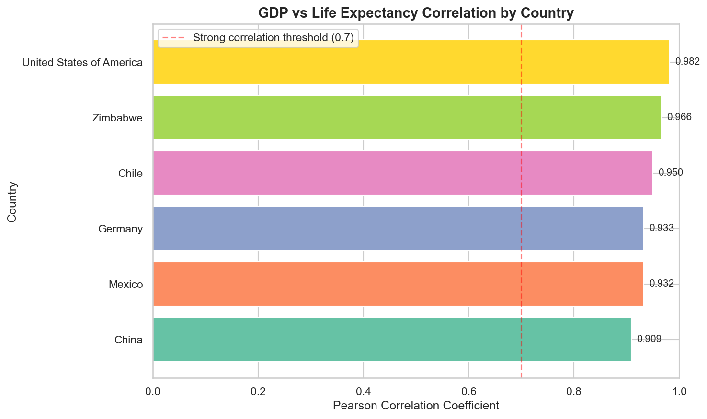
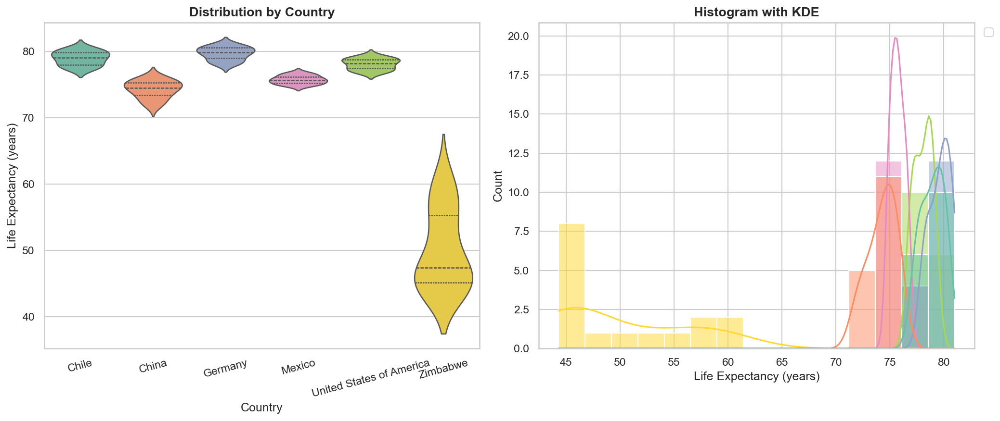
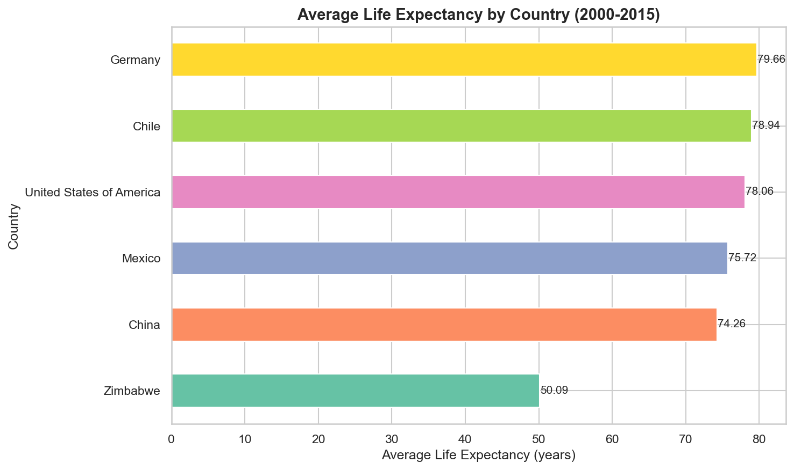

# Does Wealth Buy a Longer Life? A 15-Year Analysis of GDP and Life Expectancy Across Six Nations

*An exploration of WHO and World Bank data across Chile, China, Germany, Mexico, 
the United States, and Zimbabwe from 2000 to 2015*

---

## Introduction

What role does a country's economic output play in determining how long its 
citizens live? It seems intuitive that wealthier nations would produce 
longer-living populations, more money means better hospitals, cleaner water, 
and stronger social safety nets. But is the relationship really that simple?

To find out, I analyzed life expectancy and GDP data from the World Health 
Organization (WHO) and the World Bank across six countries: Chile, China, 
Germany, Mexico, the United States, and Zimbabwe, over a 15-year period from 
2000 to 2015. The findings are both confirming and surprising.

---

## Background & Data Sources

**What is GDP?**
Gross Domestic Product (GDP) is the total monetary value of all goods and 
services produced within a country in a given year. It is the most widely used 
measure of a nation's economic size and health. A higher GDP generally signals 
greater resources available for healthcare, education, and infrastructure, all 
of which influence how long people live.

**What is Life Expectancy?**
Life expectancy at birth is the average number of years a newborn is expected 
to live, assuming current mortality rates remain constant throughout their life. 
It is one of the most reliable single indicators of a population's overall 
health and quality of life.

**The Six Countries:**
These nations were selected to represent a wide range of economic development 
levels and geographic regions, from high-income economies like Germany and the 
USA, to rapidly developing nations like China and Chile, to lower-income 
countries like Mexico and Zimbabwe.

**Data Sources:**
- World Health Organization: https://www.who.int
- World Bank Open Data: https://data.worldbank.org

**Further Reading:**
- UN Human Development Index: https://hdr.undp.org
- WHO Global Health Observatory: https://www.who.int/data/gho

---

## Finding 1 — Life Expectancy Has Risen in Every Nation

Between 2000 and 2015, life expectancy increased in all six countries, but 
the scale of improvement varied dramatically. Germany reached the highest life 
expectancy by 2015 at 81.0 years, while Mexico recorded the smallest gain 
of just 1.9 years despite consistent economic growth.

The most remarkable story belongs to Zimbabwe, which gained 14.7 years 
of life expectancy over the period, rising from 46.0 to 60.7 years. This 
recovery followed a catastrophic decline driven by the HIV/AIDS epidemic and 
political instability in the late 1990s. The turnaround is a testament to what 
targeted public health intervention can achieve even in a resource-constrained 
environment.

---

## Finding 2 — GDP Growth Has Been Far From Equal

Economic growth over this period was dramatic but deeply uneven. China
recorded the most explosive expansion, with its GDP growing nearly 10x — from 
$1.2 trillion in 2000 to $11.1 trillion in 2015. The United States remains 
the largest economy in the dataset, growing from $10.3 trillion to $18.1 
trillion over the same period.

At the other end of the scale, Zimbabwe's GDP peaked at just $16.3 billion 
in 2015, smaller than many individual cities in the USA. Chile stands 
out as a success story among mid-sized economies, more than tripling its GDP 
from $77.9 billion to $242.5 billion.

---

## Finding 3 — Higher GDP Correlates With Higher Life Expectancy Within Each Country

When we plot GDP against life expectancy for each country individually, a clear 
positive relationship emerges in every case. Every single country in this 
dataset showed a correlation above 0.90 between GDP and life expectancy which is
an extremely strong signal.

The United States showed the strongest individual correlation at 0.982, 
meaning its life expectancy tracked GDP almost perfectly over the 15-year 
window. Chile showed the loosest individual correlation at 0.950, 
still very strong, but suggesting a slight decoupling between economic and 
health outcomes.

---

## Finding 4 — The Gap Between Nations Tells a Different Story

When we calculate the overall correlation between GDP and life expectancy across 
all six countries combined, the figure drops to just 0.343. Why?

Because the between-country differences expose the limits of GDP as a predictor. 
Chile averages a life expectancy of 78.94 years, higher than the 
United States at 78.06 years, despite having a GDP roughly 80 times 
smaller. Germany leads the entire dataset in average life expectancy at 
79.66 years, despite being economically outpaced by both the USA and China.

This tells us that how a country spends its wealth matters just as much as how 
much it has.

---

## Finding 5 — The Distribution of Life Expectancy Reveals Stark Inequality

Zimbabwe's distribution is the widest of all six nations, its life 
expectancy swung across a 14-year range over the period. Germany and Chile 
show tight, high distributions, indicating consistently long-living populations 
with little year-to-year variation.

The USA's distribution is narrower than expected given its economic 
dominance, clustering around 77–79 years throughout — a reflection of 
persistent healthcare access inequality within the country.

---

## Finding 6 — Average Life Expectancy Highlights the Outliers

Ranked by average life expectancy across the full 2000–2015 period:

| Rank | Country | Avg Life Expectancy |
|---|---|---|
| 1 | Germany | 79.66 years |
| 2 | Chile | 78.94 years |
| 3 | United States | 78.06 years |
| 4 | Mexico | 75.72 years |
| 5 | China | 74.26 years |
| 6 | Zimbabwe | 50.09 years |

The gap between Germany at the top and Zimbabwe at the bottom is nearly 
30 years, a massive difference that reflects not just economic disparity 
but historical, political, and systemic health differences between the two nations.

---

## Conclusions

The data supports a clear finding: GDP and life expectancy are strongly linked 
within any given country. As economies grow, populations live longer. But GDP 
alone cannot explain why some nations consistently outperform others with far 
greater wealth.

Chile and Germany demonstrate that strong healthcare systems and sustained social 
investment can produce life expectancy outcomes that punch well above a nation's 
economic weight. Zimbabwe shows that even without substantial GDP growth, dramatic 
health improvements are achievable through targeted public health intervention.

### Limitations:
- Only six countries were studied — findings cannot be generalized globally
- GDP is a national aggregate and does not capture income inequality within countries
- The 2000–2015 window predates COVID-19, which significantly impacted global life expectancy
- Life expectancy averages mask disparities across gender, ethnicity, and region

### Questions for further research:
- How does healthcare spending per capita change the picture?
- What specific interventions drove Zimbabwe's recovery?
- How has the relationship changed post-2015?
- Does a wider dataset of all WHO member nations confirm these findings?

---

*Full analysis and code available at:*
*https://github.com/dxsastrous/life-expectancy-gdp-analysis*

*Data sourced from the World Health Organization and the World Bank.*
*Analysis performed in Python using Pandas, Matplotlib, and Seaborn.*